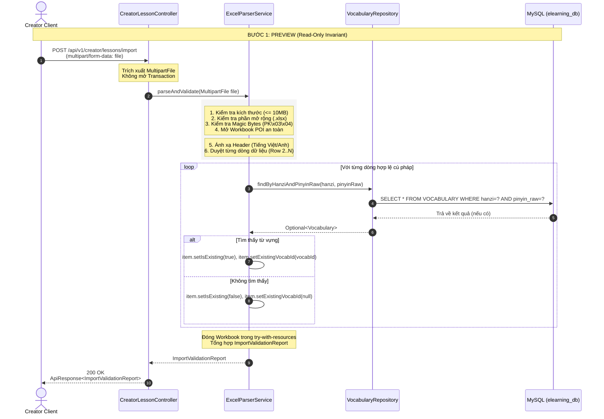
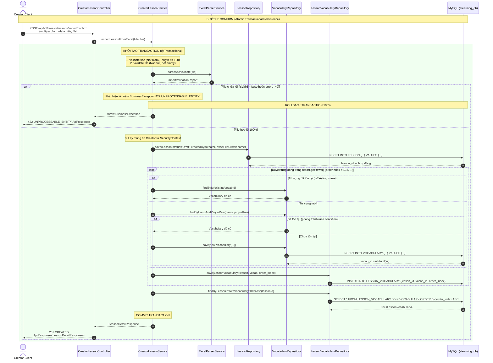
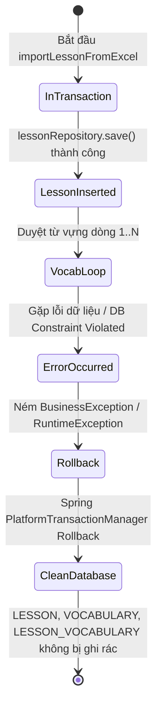
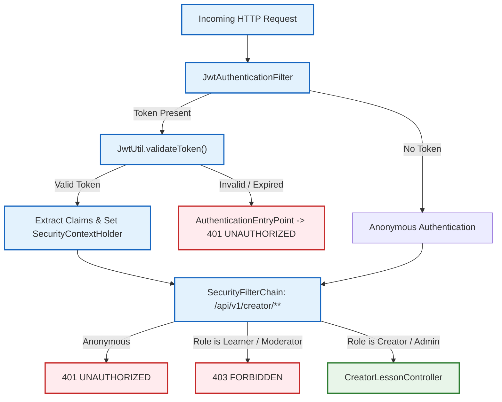
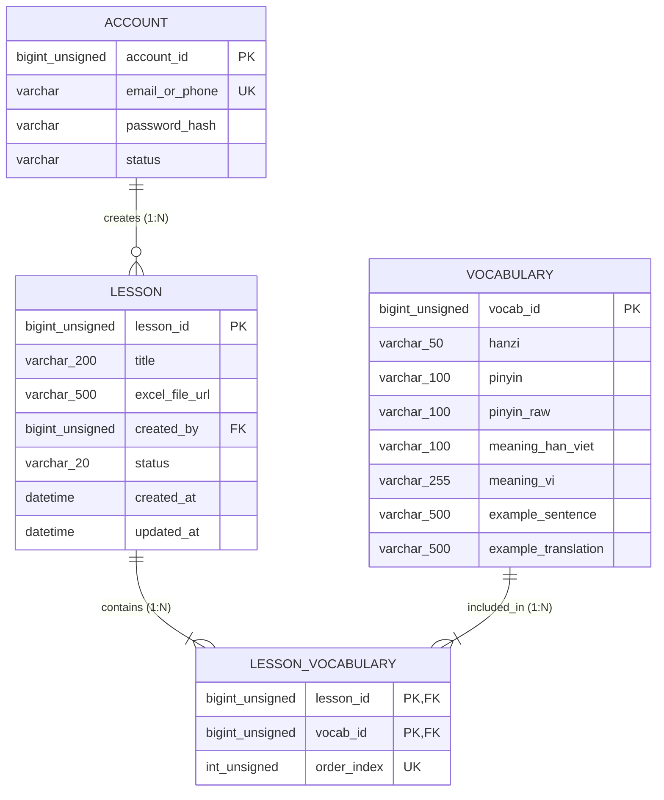

# Lesson Excel Import — Architecture & Implementation

> **Authoritative Technical Study & Architecture Document**  
> **System:** E-learning Chinese Radicals & Vocabulary System  
> **Module:** Module 5C — Two-Step Excel Import Engine (`Phase 5 — Lesson Management and Excel Import`)  
> **Document Location:** `.agents/architecture/LESSON_IMPORT_ARCHITECTURE_AND_IMPLEMENTATION.md`  
> **Source of Truth Precedence:** Actual Database Schema > Actual Source Code > `.agents/API.md` > `.agents/ARCHITECTURE.md` > `.agents/DECISIONS.md`  
> **Status:** Fully Implemented in Phase 5 and Hardened in BE-UPLOAD-001 (5000-row limit) and BE-TEST-002 (Rollback verified); Verified with 100% Test Coverage (Historical Phase 5 baseline: `467/467 tests PASS`; Current project regression baseline: `948/948 tests PASS`).  

---

## 0. Purpose

Tài liệu này là nguồn tham chiếu kỹ thuật và nghiên cứu kiến trúc (Technical Architecture & Study Guide) duy nhất cho tính năng **Lesson Excel Import (Nhập bài học từ file Excel hai bước: Preview & Confirm)**.

Mục tiêu của tài liệu:
1. Cung cấp cái nhìn toàn cảnh về kiến trúc đa tầng (Multi-tier Architecture) từ Client HTTP $\rightarrow$ Controller $\rightarrow$ Parser $\rightarrow$ Service $\rightarrow$ Repository $\rightarrow$ MySQL.
2. Làm rõ sự khác biệt bản chất giữa **Bước 1 (Preview - Stateless, Read-Only, Zero-Mutation)** và **Bước 2 (Confirm - Stateful, Atomic Transactional Persistence)**.
3. Định vị ranh giới trách nhiệm (Separation of Concerns) của từng tầng, đảm bảo Controller luôn là Thin Adapter, không chứa nghiệp vụ hay mã thư viện Apache POI.
4. Minh giải ranh giới bảo mật (Security Boundary), ranh giới giao dịch (Transaction Boundary), và quy trình cô lập lỗi (Exception Normalization).
5. Làm cẩm nang nghiên cứu (Study Guide) và hướng dẫn truy vết lỗi (Debugging Trace) thực chiến cho lập trình viên mới.

---

## 1. Architecture Overview

### 1.1 High-Level Flow

Quy trình nhập bài học từ Excel tuân thủ triệt để kiến trúc hai bước (Two-Step Workflow) nhằm ngăn ngừa tình trạng dữ liệu bẩn (dirty state) hoặc ghi dữ liệu nửa vời vào cơ sở dữ liệu:

```mermaid
graph TD
    Client(["Creator Client"]) -->|1. POST /import (file)| Controller["CreatorLessonController"]
    Controller -->|2. parseAndValidate(file)| Parser["ExcelParserService (POI)"]
    Parser -->|3. Read-only Existence Lookup| VocabRepo["VocabularyRepository"]
    VocabRepo -->|Read-only Query| MySQL[("MySQL elearning_db")]
    Parser -->|4. Return Report| Controller
    Controller -->|5. 200 OK + Report| Client

    Client -->|6. POST /import/confirm (title, file)| Controller
    Controller -->|7. importLessonFromExcel(title, file)| Service["CreatorLessonService (@Transactional)"]
    Service -->|8. Validate & Parse| Parser
    Service -->|9. Persist Lesson status='Draft'| LessonRepo["LessonRepository"]
    Service -->|10. Persist/Reuse Vocabulary| VocabRepo
    Service -->|11. Persist LessonVocabulary (order_index)| LessonVocabRepo["LessonVocabularyRepository"]
    LessonRepo -->|INSERT| MySQL
    VocabRepo -->|INSERT / SELECT| MySQL
    LessonVocabRepo -->|INSERT| MySQL
    Service -->|12. Return LessonDetailResponse| Controller
    Controller -->|13. 201 Created + LessonDetail| Client

    classDef clientStyle fill:#e1f5fe,stroke:#0288d1,stroke-width:2px;
    classDef httpStyle fill:#fff3e0,stroke:#f57c00,stroke-width:2px;
    classDef serviceStyle fill:#e8f5e9,stroke:#388e3c,stroke-width:2px;
    classDef dbStyle fill:#f3e5f5,stroke:#7b1fa2,stroke-width:2px;

    class Client clientStyle;
    class Controller httpStyle;
    class Parser,Service serviceStyle;
    class VocabRepo,LessonRepo,LessonVocabRepo,MySQL dbStyle;
```

### 1.2 Components

1. **Client (Creator Web/API Client):**
   * Tác giả bài học (Creator) tương tác qua giao diện web hoặc REST client.
   * Gửi request `multipart/form-data` kèm file `.xlsx` ở Bước 1 và `(title, file)` ở Bước 2.
2. **`CreatorLessonController` (Transport Adapter):**
   * Lớp biên tiếp nhận HTTP (HTTP Transport Boundary).
   * Trích xuất `@RequestParam("file") MultipartFile` và `@RequestParam("title") String`.
   * Hoàn toàn không chứa logic nghiệp vụ, không mở transaction, không truy vấn database, không import thư viện Apache POI.
3. **`ExcelParserService` (Inspection & Parsing Engine):**
   * Phân tích cú pháp tệp Excel nhị phân (`.xlsx`) an toàn bằng Apache POI `poi-ooxml:5.3.0`.
   * Xác thực chữ ký tệp (Magic bytes `PK\x03\x04`), giới hạn kích thước (10MB), ánh xạ tiêu đề cột (Flexible Header Mapping).
   * Kiểm tra tính hợp lệ của từng dòng dữ liệu và phát hiện dòng trùng lặp trong cùng file.
   * Tra cứu từ vựng trong MySQL theo chế độ Read-Only để phân loại từ mới hay từ đã có trong từ điển.
4. **`CreatorLessonService` (Domain Business & Persistence Orchestrator):**
   * Điều phối nghiệp vụ tạo bài học trong một ranh giới giao dịch duy nhất (`@Transactional`).
   * Xác thực thông tin tiêu đề bài học (`title`), giải quyết thông tin Creator từ `SecurityContextHolder`.
   * Lưu `Lesson` ở trạng thái ban đầu `'Draft'`, lưu các `Vocabulary` mới, và lưu liên kết `LessonVocabulary` bảo toàn thứ tự `order_index` liên tục.
5. **Spring Data JPA Repositories (`LessonRepository`, `VocabularyRepository`, `LessonVocabularyRepository`):**
   * Thực thi các câu lệnh SQL/JPQL tương tác với CSDL vật lý MySQL 8.4 LTS.
6. **`GlobalExceptionHandler` (Centralized Exception Normalizer):**
   * Bắt các ngoại lệ khung (Framework Exceptions) như `MaxUploadSizeExceededException`, `MissingServletRequestPartException` và ngoại lệ nghiệp vụ `BusinessException`.
   * Chuẩn hóa thành phong bì `ApiResponse` đồng nhất theo quy chuẩn `.agents/API.md`.

### 1.3 Responsibilities & Boundary Invariants

* **Tính bất biến Zero-Mutation ở Bước 1 (Preview):** Bước xem trước tuyệt đối không thực hiện bất kỳ thao tác `INSERT`, `UPDATE`, hoặc `DELETE` nào trên database. Toàn bộ quá trình tra cứu từ điển được đánh dấu `@Transactional(readOnly = true)`.
* **Tính nguyên tử (Atomicity) ở Bước 2 (Confirm):** Mọi thao tác ghi dữ liệu (tạo Lesson, tạo Vocabulary, tạo LessonVocabulary) diễn ra trong một giao dịch cơ sở dữ liệu duy nhất. Nếu xảy ra bất kỳ lỗi dữ liệu hoặc ngoại lệ nào, hệ thống lập tức rollback 100%, không để lại bất kỳ bản ghi rác nào.
* **Quyền sở hữu Creator (Creator Ownership Isolation):** Bài học được tạo bắt buộc liên kết với tài khoản của Creator đang đăng nhập lấy từ token JWT, không bao giờ nhận `creator_id` từ client input.

---

## 2. Preview Flow (Bước 1: Tải lên & Xem trước)

Mục đích của Preview là cung cấp cho Creator một bảng báo cáo chi tiết (`ImportValidationReport`) về số lượng dòng hợp lệ, số lượng từ mới, số lượng từ đã tồn tại trong hệ thống, và danh sách các lỗi định dạng cấp dòng (Row-level validation errors) mà không làm thay đổi trạng thái hệ thống.



### 2.1 Request

* **HTTP Method:** `POST`
* **Authoritative Endpoint:** `/api/v1/creator/lessons/import` (theo `.agents/API.md` line 85)
* **Content-Type:** `multipart/form-data`
* **Multipart Part Name:** `file`
* **Authentication & Authorization:** Bắt buộc Header `Authorization: Bearer <JWT>`, tài khoản phải có quyền `ROLE_CREATOR` hoặc `ROLE_ADMIN`.

### 2.2 Controller Binding

Trong [`CreatorLessonController.java`](file:///c:/Users/LENOVO/Downloads/elearning-1.0.0-20260819T062551Z-1-002/elearning-1.0.0/elearning-1.0.0/backend/src/main/java/com/elearning/controller/CreatorLessonController.java):
```java
@PostMapping(value = "/import", consumes = MediaType.MULTIPART_FORM_DATA_VALUE)
public ResponseEntity<ApiResponse<ImportValidationReport>> importPreview(
        @RequestParam("file") MultipartFile file) {
    ImportValidationReport report = excelParserService.parseAndValidate(file);
    return ResponseEntity.ok(ApiResponse.success(report));
}
```
Controller nhận `MultipartFile`, ủy quyền toàn bộ cho `ExcelParserService.parseAndValidate(file)`, và bọc kết quả vào `ApiResponse.success(report)` với HTTP status `200 OK`.

### 2.3 Parser Pipeline

Pipeline phân tích trong [`ExcelParserServiceImpl.java`](file:///c:/Users/LENOVO/Downloads/elearning-1.0.0-20260819T062551Z-1-002/elearning-1.0.0/elearning-1.0.0/backend/src/main/java/com/elearning/service/impl/ExcelParserServiceImpl.java) diễn ra qua 6 giai đoạn nghiêm ngặt:
1. **Empty File & Size Guard:** Kiểm tra `file.isEmpty()` và `file.getSize() > 10MB`.
2. **Extension Check (Defense-in-depth):** Kiểm tra tên tệp kết thúc bằng `.xlsx`.
3. **Magic Byte Signature Inspection:** Đọc 4 byte đầu tiên từ luồng nhị phân và đối chiếu với chữ ký chuẩn ZIP/OOXML: `{0x50, 0x4B, 0x03, 0x04}` (`PK\x03\x04`). Ngăn chặn tệp thực thi, script hoặc văn bản giả mạo đuôi `.xlsx`.
4. **Sandboxed POI Workbook Instantiation:** Mở workbook trong khối `try (Workbook workbook = WorkbookFactory.create(bis))`. Bắt riêng `EmptyFileException`, `NotOfficeXmlFileException`, và `EncryptedDocumentException` (tệp có mật khẩu).
5. **Header Normalization & Resolution:** Chuẩn hóa chuỗi (loại bỏ dấu tiếng Việt, ký tự đặc biệt, chuyển chữ thường) để nhận diện các biến thể cột linh hoạt:
   * Chữ Hán: `"chuhan"`, `"hanzi"`, `"tuvung"`, `"chinese"`, `"chuhantu"`.
   * Pinyin: `"pinyin"`, `"phienam"`.
   * Hán-Việt: `"hanviet"`, `"meaninghanviet"`, `"amhanviet"`, `"nghiahanviet"`.
   * Nghĩa tiếng Việt: `"nghia"`, `"meaningvi"`, `"nghiatiengviet"`, `"giainghia"`, `"vietnamesemeaning"`.
   * Ví dụ & Dịch: `"examplesentence"`, `"cauvidu"`, `"vidu"`, `"exampletranslation"`, `"dichcauvidu"`.
6. **Row Iteration & In-File Duplicate Detection:**
   * Bỏ qua dòng trống hoàn toàn.
   * Chuyển đổi Pinyin có dấu thành `pinyinRaw` không dấu (ví dụ: `xué` $\rightarrow$ `xue`).
   * Sử dụng composite key `(hanzi.trim() + "|" + pinyinRaw.trim())` để phát hiện dòng trùng lặp xuất hiện nhiều lần trong cùng file.
   * Tra cứu CSDL qua `vocabularyRepository.findByHanziAndPinyinRaw(...)` để xác định `isExisting`.

### 2.4 Validation Report Data Structure

[`ImportValidationReport.java`](file:///c:/Users/LENOVO/Downloads/elearning-1.0.0-20260819T062551Z-1-002/elearning-1.0.0/elearning-1.0.0/backend/src/main/java/com/elearning/dto/response/ImportValidationReport.java) trả về cấu trúc phân cấp:
* `isValid` (`Boolean`): `true` nếu toàn bộ các dòng đều hợp lệ cú pháp và không có lỗi tệp; `false` nếu có ít nhất 1 lỗi.
* `totalRows` (`Integer`): Tổng số dòng dữ liệu có nội dung (không tính header và dòng trống).
* `validRowsCount` (`Integer`): Số dòng hợp lệ sẵn sàng để import.
* `invalidRowsCount` (`Integer`): Số dòng chứa lỗi.
* `newVocabCount` (`Integer`): Số lượng từ vựng mới chưa có trong hệ thống (sẽ được tạo mới ở Bước 2).
* `existingVocabCount` (`Integer`): Số lượng từ vựng đã tồn tại trong CSDL (sẽ được liên kết tái sử dụng).
* `fileStatus` (`String`): Mã trạng thái tệp (`"VALID"`, `"INVALID"`, `"EMPTY_FILE"`, `"HEADER_ERROR"`, `"INVALID_FORMAT"`, `"FILE_TOO_LARGE"`).
* `summaryMessage` (`String`): Chuỗi tóm tắt người dùng đọc được.
* `rows` (`List<ParsedVocabularyItem>`): Danh sách chi tiết từng dòng dữ liệu kèm cờ `isValid`, `isExisting`, `existingVocabId`, và danh sách lỗi riêng của dòng đó.
* `errors` (`List<RowValidationError>`): Danh sách phẳng tất cả các lỗi cấp dòng (`rowNumber`, `columnName`, `errorCode`, `errorMessage`).

### 2.5 HTTP Response Format

Preview luôn trả về HTTP `200 OK` (ngay cả khi file chứa dòng lỗi) để phía client có thể hiển thị bảng chi tiết các lỗi cần chỉnh sửa:
```json
{
  "code": "SUCCESS",
  "message": "Thao tác thành công",
  "errors": [],
  "data": {
    "isValid": false,
    "totalRows": 2,
    "validRowsCount": 1,
    "invalidRowsCount": 1,
    "newVocabCount": 1,
    "existingVocabCount": 0,
    "fileStatus": "INVALID",
    "summaryMessage": "Phát hiện lỗi: 1/2 dòng không hợp lệ, 1 dòng hợp lệ",
    "rows": [
      {
        "rowNumber": 2,
        "hanzi": "学",
        "pinyin": "xué",
        "pinyinRaw": "xue",
        "meaningHanViet": "Học",
        "meaningVi": "Học tập",
        "isExisting": false,
        "existingVocabId": null,
        "isValid": true,
        "errors": []
      },
      {
        "rowNumber": 3,
        "hanzi": "",
        "pinyin": "cuò",
        "pinyinRaw": "cuo",
        "meaningHanViet": "Thác",
        "meaningVi": "Sai lầm",
        "isExisting": false,
        "existingVocabId": null,
        "isValid": false,
        "errors": ["Chữ Hán không được để trống"]
      }
    ],
    "errors": [
      {
        "rowNumber": 3,
        "columnName": "Chữ Hán",
        "errorCode": "MISSING_REQUIRED_FIELD",
        "errorMessage": "Chữ Hán không được để trống"
      }
    ]
  }
}
```

---

## 3. Preview Database Behavior

Bảng sau đây thể hiện rõ ràng hành vi tương tác CSDL trong suốt quá trình Preview:

| Database Entity / Operation | Thực hiện trong Preview? | Cơ chế đảm bảo (Enforcement Mechanism) |
| :--- | :---: | :--- |
| **SELECT `VOCABULARY`** | **CÓ (YES)** | `vocabularyRepository.findByHanziAndPinyinRaw(...)` dùng để gán cờ `isExisting`. |
| **INSERT `LESSON`** | **KHÔNG (NO)** | Không gọi `LessonRepository.save()`. |
| **INSERT `VOCABULARY`** | **KHÔNG (NO)** | Không gọi `VocabularyRepository.save()`. |
| **INSERT `LESSON_VOCABULARY`** | **KHÔNG (NO)** | Không gọi `LessonVocabularyRepository.save()`. |
| **UPDATE / DELETE Any Table** | **KHÔNG (NO)** | Không có thao tác ghi hoặc xóa. |
| **Transactional Mode** | **READ-ONLY** | Class-level `@Transactional(readOnly = true)` trên `ExcelParserServiceImpl`. |

*Bằng chứng xác thực:* Đã kiểm chứng tự động trong [`ExcelImportIntegrationTests.testPreview_zeroDbMutations`](file:///c:/Users/LENOVO/Downloads/elearning-1.0.0-20260819T062551Z-1-002/elearning-1.0.0/elearning-1.0.0/backend/src/test/java/com/elearning/ExcelImportIntegrationTests.java): đếm số lượng bản ghi `lessonRepository.count()`, `vocabularyRepository.count()`, `lessonVocabularyRepository.count()` trước và sau khi gọi API preview, đảm bảo số lượng giữ nguyên 100%.

---

## 4. Confirm Flow (Bước 2: Xác nhận & Lưu giao dịch)

Confirm là bước chuyển hóa dữ liệu đã kiểm duyệt thành các thực thể quan hệ bền vững trong CSDL MySQL. Toàn bộ quá trình diễn ra trong một giao dịch đơn nhất (Single Atomic Transaction).



### 4.1 Request

* **HTTP Method:** `POST`
* **Authoritative Endpoint:** `/api/v1/creator/lessons/import/confirm` (theo `.agents/API.md` line 86)
* **Content-Type:** `multipart/form-data`
* **Parameters:**
  * `title` (`String` - `@RequestParam`): Tiêu đề của bài học mới cần tạo (Bắt buộc, không để trống, tối đa 100 ký tự).
  * `file` (`MultipartFile` - `@RequestParam`): Tệp Excel `.xlsx` chứa dữ liệu bài học.
* **Authentication & Authorization:** Header `Authorization: Bearer <JWT>`, yêu cầu quyền `ROLE_CREATOR` hoặc `ROLE_ADMIN`.

### 4.2 Re-Validation Inside Transaction

Mặc dù người dùng đã chạy Preview trước đó, hệ thống **không bao giờ tin tưởng client** sẽ gửi lại đúng file đã preview. Trong phương thức `importLessonFromExcel`, service thực hiện phân tích lại file từ đầu:
* Nếu `!report.getIsValid()` $\rightarrow$ ném ngay `BusinessException(ErrorCode.UNPROCESSABLE_ENTITY)`.
* Nếu file không có dòng dữ liệu nào $\rightarrow$ ném `BusinessException(ErrorCode.BAD_REQUEST)`.
* Việc ném exception sẽ kích hoạt rollback hoàn toàn transaction hiện tại.

### 4.3 Persistence Steps & Order Index Preservation

1. **Khởi tạo Bài học (`Lesson`):**
   * Tiêu đề: `title.trim()`.
   * Tác giả: Tài khoản `Account` của Creator đăng nhập lấy từ `SecurityContextHolder`.
   * Trạng thái mặc định: `'Draft'`.
   * URL tệp gốc: `file.getOriginalFilename()`.
   * Thực hiện: `lessonRepository.save(lesson)`.
2. **Xử lý Từ vựng (`Vocabulary`):**
   * Đối với từ đã có (`isExisting == true`): lấy từ database thông qua `existingVocabId`.
   * Đối với từ mới: kiểm tra kép bằng composite key `(hanzi, pinyinRaw)`. Nếu chưa có, tạo thực thể `Vocabulary` mới với đầy đủ nghĩa Hán-Việt, nghĩa tiếng Việt, câu ví dụ, dịch ví dụ và lưu bằng `vocabularyRepository.save(newVocab)`.
3. **Liên kết Bài học - Từ vựng (`LessonVocabulary`):**
   * Tạo khóa phức hợp `LessonVocabularyId(lessonId, vocabId)`.
   * Gán `orderIndex = order++` bắt đầu từ `1`, tăng tuần tự theo thứ tự xuất hiện của dòng trong file Excel.
   * Thực hiện: `lessonVocabularyRepository.save(lv)`.
   * Bảo toàn triệt để ràng buộc CSDL: `uk_lesson_order_index` UNIQUE (`lesson_id`, `order_index`).

### 4.4 HTTP Response Format

Trả về HTTP `201 CREATED` kèm dữ liệu chi tiết bài học đã tạo:
```json
{
  "code": "SUCCESS",
  "message": "Import bài học từ Excel thành công",
  "errors": [],
  "data": {
    "lessonId": 15,
    "title": "Bài 1: Làm quen tiếng Trung",
    "status": "Draft",
    "totalVocabs": 2,
    "createdAt": "2026-08-27T22:05:35",
    "updatedAt": "2026-08-27T22:05:35",
    "vocabularies": [
      {
        "vocabId": 10,
        "hanzi": "中",
        "pinyin": "zhōng",
        "pinyinRaw": "zhong",
        "meaningHanViet": "Trung",
        "meaningVi": "Ở giữa, trung tâm",
        "exampleSentence": "中国很大。",
        "exampleTranslation": "Trung Quốc rất lớn.",
        "orderIndex": 1
      },
      {
        "vocabId": 25,
        "hanzi": "国",
        "pinyin": "guó",
        "pinyinRaw": "guo",
        "meaningHanViet": "Quốc",
        "meaningVi": "Đất nước, quốc gia",
        "exampleSentence": "国家。",
        "exampleTranslation": "Quốc gia.",
        "orderIndex": 2
      }
    ]
  }
}
```

---

## 5. Transaction Boundary & Rollback Mechanics

### 5.1 Vị trí Transaction Boundary

```text
Transaction starts at:
com.elearning.service.impl.CreatorLessonServiceImpl.importLessonFromExcel(String, MultipartFile)
via @Transactional

Transaction covers:
├── File re-parsing & validation via ExcelParserService
├── Identity resolution via resolveCurrentAccount()
├── Lesson entity instantiation & INSERT into LESSON
├── Vocabulary entity instantiation & INSERT into VOCABULARY (for new words)
├── LessonVocabulary linking & INSERT into LESSON_VOCABULARY (preserving order_index)
└── JPA Flush & Commit at method exit

Transaction ends at:
Method return of CreatorLessonServiceImpl.importLessonFromExcel
```

* **Tuyệt đối không đặt `@Transactional` trên Controller:** Controller chỉ đóng vai trò Transport Adapter. Mở transaction tại Controller sẽ giữ kết nối CSDL (database connection) trong lúc client upload stream hoặc trong lúc phân tích file nhị phân dung lượng lớn, gây cạn kiệt Connection Pool của HikariCP.

### 5.2 Rollback Invariant Matrix

Nếu một ngoại lệ dạng `RuntimeException` (như `BusinessException`, `DataIntegrityViolationException`, v.v.) xảy ra tại bất kỳ thời điểm nào trước khi phương thức service kết thúc:



* **Kịch bản: Đã chèn `LESSON`, nhưng chèn `LESSON_VOCABULARY` thất bại:**
  * Do toàn bộ quá trình nằm trong 1 Transaction, câu lệnh `ROLLBACK` của MySQL sẽ hủy bỏ cả bản ghi `LESSON` vừa chèn và mọi bản ghi `VOCABULARY` mới chèn trong phiên đó.
  * Trạng thái CSDL trở về nguyên vẹn như trước khi gửi request.
  * *Bằng chứng kiểm thử:* Đã kiểm chứng trong [`ExcelImportIntegrationTests.testConfirm_invalidData_rollsBack`](file:///c:/Users/LENOVO/Downloads/elearning-1.0.0-20260819T062551Z-1-002/elearning-1.0.0/elearning-1.0.0/backend/src/test/java/com/elearning/ExcelImportIntegrationTests.java).

---

## 6. Component Responsibility Matrix

| Thành phần (Component) | Trách nhiệm chính (Primary Responsibility) | Những điều TUYỆT ĐỐI KHÔNG làm (Must NOT do) |
| :--- | :--- | :--- |
| **`CreatorLessonController`** | - Tiếp nhận HTTP Request `multipart/form-data`<br>- Binds `@RequestParam` cho `file` và `title`<br>- Ủy quyền cho Parser / Service<br>- Trả về HTTP Status 200/201 kèm phong bì `ApiResponse` | - KHÔNG gọi Apache POI hoặc parse file<br>- KHÔNG mở giao dịch `@Transactional`<br>- KHÔNG truy cập trực tiếp `Repository` hoặc `EntityManager`<br>- KHÔNG chứa nghiệp vụ xác thực quyền sở hữu |
| **`ExcelParserService`** | - Kiểm tra bảo mật file (Kích thước $\le 10$MB, Magic bytes, Extension)<br>- Phân tích cấu trúc bảng tính bằng Apache POI<br>- Ánh xạ tiêu đề cột linh hoạt<br>- Kiểm tra ràng buộc độ dài và tính bắt buộc từng ô<br>- Phát hiện trùng lặp dòng trong file<br>- Tra cứu CSDL kiểm tra tồn tại từ vựng (Read-only) | - KHÔNG thực hiện thao tác ghi/sửa/xóa CSDL<br>- KHÔNG phụ thuộc vào Spring Security hay HTTP Context<br>- KHÔNG quyết định quyền hạn của người dùng |
| **`CreatorLessonService`** | - Quản lý ranh giới giao dịch `@Transactional`<br>- Xác thực quyền sở hữu và giải quyết danh tính Creator<br>- Tạo thực thể `Lesson` với trạng thái `'Draft'`<br>- Điều phối lưu `Vocabulary` mới và liên kết `LessonVocabulary`<br>- Đảm bảo thứ tự `order_index` liên tục | - KHÔNG xử lý các chi tiết giao thức HTTP (Headers, Multipart binding)<br>- KHÔNG parse file nhị phân trực tiếp (ủy quyền cho `ExcelParserService`) |
| **Spring Data Repositories** | - Cung cấp các thao tác CRUD và truy vấn JPQL/SQL chuẩn xác<br>- Thực thi các ràng buộc toàn vẹn khóa ngoại | - KHÔNG chứa logic nghiệp vụ hay điều phối workflow đa bước |
| **Spring Security & Filter** | - Trích xuất Bearer JWT token<br>- Xác thực và cấp quyền cho role `Creator` hoặc `Admin`<br>- Từ chối 401 unauthenticated và 403 unauthorized | - KHÔNG can thiệp vào quá trình parse file hoặc lưu bài học |
| **`GlobalExceptionHandler`** | - Bắt các ngoại lệ khung và ngoại lệ nghiệp vụ<br>- Ánh xạ thành mã lỗi chuẩn (`ErrorCode`) và HTTP Status tương ứng | - KHÔNG thực hiện rollback thủ công hoặc can thiệp dữ liệu |

---

## 7. API Contract

Chi tiết hợp đồng giao tiếp chuẩn xác theo `.agents/API.md`:

### 7.1 Bước 1: Upload và Xem trước (Preview)

* **HTTP Method:** `POST`
* **Endpoint Path:** `/api/v1/creator/lessons/import`
* **Content-Type:** `multipart/form-data`
* **Authentication:** Bắt buộc Header `Authorization: Bearer <token>`
* **Authorization Role:** `Creator` hoặc `Admin`
* **Request Part:**
  * `file`: Tệp tin `.xlsx` nhị phân (dung lượng $\le 10$MB).
* **Response Payload:** `ApiResponse<ImportValidationReport>`
* **HTTP Status Code:** `200 OK`
* **Response Example:**
  ```json
  {
    "code": "SUCCESS",
    "message": "Thao tác thành công",
    "errors": [],
    "data": {
      "isValid": true,
      "totalRows": 15,
      "validRowsCount": 15,
      "invalidRowsCount": 0,
      "newVocabCount": 12,
      "existingVocabCount": 3,
      "fileStatus": "VALID",
      "summaryMessage": "Kiểm tra thành công: 15 dòng hợp lệ (12 từ mới, 3 từ đã có trong từ điển)",
      "rows": [ ... ],
      "errors": []
    }
  }
  ```

### 7.2 Bước 2: Xác nhận tạo bài học (Confirm)

* **HTTP Method:** `POST`
* **Endpoint Path:** `/api/v1/creator/lessons/import/confirm`
* **Content-Type:** `multipart/form-data`
* **Authentication:** Bắt buộc Header `Authorization: Bearer <token>`
* **Authorization Role:** `Creator` hoặc `Admin`
* **Request Parts / Parameters:**
  * `title`: Tiêu đề bài học (Text, không rỗng, tối đa 100 ký tự).
  * `file`: Tệp tin `.xlsx` nhị phân.
* **Response Payload:** `ApiResponse<LessonDetailResponse>`
* **HTTP Status Code:** `201 CREATED`
* **Response Example:**
  ```json
  {
    "code": "SUCCESS",
    "message": "Import bài học từ Excel thành công",
    "errors": [],
    "data": {
      "lessonId": 42,
      "title": "Học từ vựng HSK 1 - Bài 1",
      "status": "Draft",
      "totalVocabs": 15,
      "createdAt": "2026-08-27T22:10:00",
      "updatedAt": "2026-08-27T22:10:00",
      "vocabularies": [ ... ]
    }
  }
  ```

---

## 8. Security Architecture & Authorization Flow

Luồng xác thực và phân quyền diễn ra trước khi request chạm tới Controller:



* **Cấu hình Spring Security (`SecurityConfig.java`):**
  ```java
  .requestMatchers("/api/v1/creator/**").hasAnyRole("Creator", "Admin", "CREATOR", "ADMIN")
  ```
* **Ma trận phân quyền:**
  1. **Khách vãng lai (Anonymous / Không truyền JWT):** Bị chặn bởi `AuthenticationEntryPoint` $\rightarrow$ Trả về `401 UNAUTHORIZED` kèm JSON chuẩn:
     `{"code":"UNAUTHORIZED","message":"Chưa xác thực hoặc phiên đăng nhập đã hết hạn","errors":[],"data":null}`.
  2. **Học viên (`Learner`) hoặc Kiểm duyệt viên (`Moderator`):** Có token hợp lệ nhưng thiếu vai trò $\rightarrow$ Bị chặn bởi Spring Security $\rightarrow$ Trả về `403 FORBIDDEN`.
  3. **Tác giả bài học (`Creator`) hoặc Quản trị viên (`Admin`):** Được cấp quyền truy cập đầy đủ vào 2 endpoints `/import` và `/import/confirm`.
* **Trích xuất danh tính tác giả an toàn:**
  Trong `CreatorLessonServiceImpl.resolveCurrentAccount()`:
  ```java
  Authentication authentication = SecurityContextHolder.getContext().getAuthentication();
  String emailOrPhone = authentication.getName();
  Account currentAccount = accountRepository.findByEmailOrPhone(emailOrPhone)
          .orElseThrow(() -> new BusinessException(ErrorCode.UNAUTHORIZED, "Tài khoản không tồn tại"));
  ```
  Tuyệt đối không nhận `accountId` qua tham số HTTP, loại bỏ hoàn toàn lỗ hổng IDOR (Insecure Direct Object References).

---

## 9. File Upload Security & Defense-in-Depth

Tuân thủ nghiêm ngặt **OWASP File Upload Cheat Sheet** và **OWASP Input Validation Cheat Sheet**, cơ chế bảo mật tệp áp dụng nguyên tắc phòng vệ đa tầng (Defense-in-depth):

1. **Không tin tưởng Header `Content-Type` do Client gửi:** Client có thể dễ dàng giả mạo MIME type thành `application/vnd.openxmlformats-officedocument.spreadsheetml.sheet`. Hệ thống không sử dụng MIME type làm thẩm quyền bảo mật duy nhất.
2. **Kiểm tra chữ ký nhị phân Magic Bytes:**
   * Tệp `.xlsx` thực chất là một gói nén ZIP chứa các tệp XML.
   * Parser đọc 4 byte đầu tiên và xác thực khớp với chuỗi byte chuẩn: `0x50, 0x4B, 0x03, 0x04` (`PK\x03\x04`).
   * Bất kỳ tệp thực thi (`.exe`), script độc hại, hay tệp văn bản giả mạo đều bị từ chối ngay lập tức trước khi phân tích nội dung XML.
3. **Giới hạn kích thước tệp nghiêm ngặt (File Size Restriction):**
   * Tầng Web Server / Servlet Filter: Cấu hình `spring.servlet.multipart.max-file-size: 10MB` và `max-request-size: 10MB`. Nếu vượt quá, Spring ném `MaxUploadSizeExceededException`, được bắt tại `GlobalExceptionHandler` trả về HTTP `413 FILE_TOO_LARGE`.
   * Tầng Service: `ExcelParserServiceImpl` kiểm tra hằng số `MAX_FILE_SIZE_BYTES = 10 * 1024 * 1024L`.
4. **Phòng chống tấn công cạn kiệt tài nguyên (ZIP Bomb / Resource Exhaustion):**
   * Quá trình đọc stream sử dụng bộ đệm `BufferedInputStream`.
   * Luồng dữ liệu và đối tượng `Workbook` được đóng tự động và giải phóng bộ nhớ heap thông qua `try-with-resources`.
5. **Xử lý tệp bị mã hóa bảo vệ (Password Protected):** Bắt riêng ngoại lệ `EncryptedDocumentException` của Apache POI và thông báo rõ ràng cho người dùng, ngăn chặn tình trạng treo luồng xử lý (thread hanging).

---

## 10. Error Handling & Exception Normalization

Toàn bộ các ngoại lệ phát sinh trong quá trình upload và xử lý file Excel được chuẩn hóa tại [`GlobalExceptionHandler.java`](file:///c:/Users/LENOVO/Downloads/elearning-1.0.0-20260819T062551Z-1-002/elearning-1.0.0/elearning-1.0.0/backend/src/main/java/com/elearning/exception/GlobalExceptionHandler.java):

| Tình huống ngoại lệ (Scenario) | Lớp Exception thực tế | Mã lỗi `ErrorCode` | HTTP Status | Cấu trúc Response |
| :--- | :--- | :--- | :---: | :--- |
| **Dung lượng file vượt quá 10MB** | `MaxUploadSizeExceededException` | `FILE_TOO_LARGE` | **413** | `{"code":"FILE_TOO_LARGE","message":"File import vượt quá dung lượng cho phép"}` |
| **Thiếu phần file hoặc thiếu title** | `MissingServletRequestPartException`, `MissingServletRequestParameterException` | `VALIDATION_ERROR` | **400** | `{"code":"VALIDATION_ERROR","message":"Tham số yêu cầu không hợp lệ hoặc bị thiếu"}` |
| **File rỗng (0 bytes) ở Confirm** | `BusinessException` | `BAD_REQUEST` | **400** | `{"code":"BAD_REQUEST","message":"File tải lên không có dữ liệu"}` |
| **Tiêu đề bài học trống ở Confirm** | `BusinessException` | `BAD_REQUEST` | **400** | `{"code":"BAD_REQUEST","message":"Tiêu đề bài học không được để trống"}` |
| **Tiêu đề bài học vượt quá 100 ký tự**| `BusinessException` | `BAD_REQUEST` | **400** | `{"code":"BAD_REQUEST","message":"Tiêu đề bài học không được vượt quá 100 ký tự"}` |
| **File chứa lỗi dữ liệu ở Confirm** | `BusinessException` | `UNPROCESSABLE_ENTITY` | **422** | `{"code":"UNPROCESSABLE_ENTITY","message":"File Excel không hợp lệ hoặc chứa lỗi dữ liệu: ..."}` |
| **Chưa đăng nhập (Anonymous)** | `AuthenticationEntryPoint` | `UNAUTHORIZED` | **401** | `{"code":"UNAUTHORIZED","message":"Chưa xác thực hoặc phiên đăng nhập đã hết hạn"}` |
| **Sai vai trò (Learner gọi Creator API)** | `AccessDeniedException` | `FORBIDDEN` | **403** | Spring Security 403 Forbidden Envelope |
| **Vi phạm toàn vẹn CSDL (Unique index)**| `DataIntegrityViolationException` | `CONFLICT` | **409** | `{"code":"CONFLICT","message":"Dữ liệu đã tồn tại hoặc vi phạm ràng buộc toàn vẹn"}` |

---

## 11. Data Flow Across Architecture Boundaries

Biểu đồ dưới đây thể hiện sự biến đổi của đối tượng dữ liệu qua từng tầng:

```text
[HTTP Multipart Binary Stream]
       │
       ▼
org.springframework.web.multipart.MultipartFile
       │
       ▼ (ExcelParserService)
org.apache.poi.ss.usermodel.Workbook / Sheet / Row / Cell
       │
       ▼ (Row Mapping & Validation)
com.elearning.dto.response.ParsedVocabularyItem & RowValidationError
       │
       ▼ (Report Aggregation)
com.elearning.dto.response.ImportValidationReport
       │
       ├──[Preview Flow] ─────────► ApiResponse<ImportValidationReport> ──► JSON HTTP 200
       │
       ▼ [Confirm Flow - CreatorLessonService]
com.elearning.entity.Lesson (status='Draft')
       +
com.elearning.entity.Vocabulary (persisted / retrieved)
       +
com.elearning.entity.LessonVocabulary (with order_index)
       │
       ▼ (Spring Data JPA Repositories)
[MySQL 8.4 physical tables: LESSON, VOCABULARY, LESSON_VOCABULARY]
       │
       ▼
com.elearning.dto.response.LessonDetailResponse
       │
       ▼
ApiResponse<LessonDetailResponse> ──► JSON HTTP 201
```

---

## 12. Persistence Model & MySQL Schema Mapping

Dữ liệu được lưu trữ tại 4 bảng chính trong MySQL `elearning_db`:



### Các bước thao tác thực thể cụ thể:
1. **CREATE `Lesson`:** Tạo bản ghi mới trong bảng `LESSON`, trường `created_by` tham chiếu đến `ACCOUNT.account_id`, trường `status` khởi tạo giá trị `'Draft'` (thỏa mãn ràng buộc `chk_lesson_status`).
2. **LOOKUP / REUSE `Vocabulary`:**
   * Dựa trên composite index `uk_vocab_hanzi_pinyin_raw` trên `(hanzi, pinyin_raw)`.
   * Nếu từ vựng đã tồn tại: tái sử dụng khóa chính `vocab_id`.
   * Nếu từ vựng chưa tồn tại: thực hiện **CREATE `Vocabulary`** để chèn bản ghi mới.
3. **LINK & ORDER `LessonVocabulary`:**
   * Chèn bản ghi vào bảng liên kết `LESSON_VOCABULARY`.
   * Gán `order_index` liên tục ($1, 2, 3, \dots, N$).
   * Bảo toàn khóa chính phức hợp `PRIMARY KEY (lesson_id, vocab_id)` và ràng buộc duy nhất `uk_lesson_order_index UNIQUE (lesson_id, order_index)`.

---

## 13. Source Code Mapping

Bảng đối chiếu trách nhiệm kiến trúc với mã nguồn thực tế:

| Trách nhiệm kiến trúc (Architecture Responsibility) | Lớp thực tế (Actual Class) | Phương thức thực tế (Actual Method) | Đường dẫn tệp (File Path) |
| :--- | :--- | :--- | :--- |
| **HTTP Transport Boundary** | `CreatorLessonController` | `importPreview(MultipartFile)`<br>`importConfirm(String, MultipartFile)` | `backend/src/main/java/com/elearning/controller/CreatorLessonController.java` |
| **Excel Security & Parsing** | `ExcelParserServiceImpl` | `parseAndValidate(MultipartFile)`<br>`parseAndValidate(InputStream, String)` | `backend/src/main/java/com/elearning/service/impl/ExcelParserServiceImpl.java` |
| **Row Validation & Duplicate Detection** | `ExcelParserServiceImpl` | `processSheet(Sheet)`<br>`parseRow(...)` | `backend/src/main/java/com/elearning/service/impl/ExcelParserServiceImpl.java` |
| **Vocabulary Read-Only Lookup** | `VocabularyRepository` | `findByHanziAndPinyinRaw(String, String)` | `backend/src/main/java/com/elearning/repository/VocabularyRepository.java` |
| **Confirm Orchestration & Transaction** | `CreatorLessonServiceImpl` | `importLessonFromExcel(String, MultipartFile)` | `backend/src/main/java/com/elearning/service/impl/CreatorLessonServiceImpl.java` |
| **Lesson Persistence** | `LessonRepository` | `save(Lesson)` | `backend/src/main/java/com/elearning/repository/LessonRepository.java` |
| **Vocabulary Persistence** | `VocabularyRepository` | `save(Vocabulary)` | `backend/src/main/java/com/elearning/repository/VocabularyRepository.java` |
| **Lesson-Vocabulary Link Persistence** | `LessonVocabularyRepository` | `save(LessonVocabulary)` | `backend/src/main/java/com/elearning/repository/LessonVocabularyRepository.java` |
| **Multipart & Upload Error Normalization** | `GlobalExceptionHandler` | `handleMaxUploadSizeExceededException(...)`<br>`handleMissingRequestParameterOrPartException(...)` | `backend/src/main/java/com/elearning/exception/GlobalExceptionHandler.java` |
| **Security RBAC Rule Definition** | `SecurityConfig` | `securityFilterChain(HttpSecurity)` | `backend/src/main/java/com/elearning/config/SecurityConfig.java` |

---

## 14. How to Study This Flow (Developer Onboarding Guide)

Một lập trình viên mới khi tiếp cận tính năng này nên đọc mã nguồn theo 9 bước tuần tự:

1. **Bước 1 — Đọc [`CreatorLessonController.java`](file:///c:/Users/LENOVO/Downloads/elearning-1.0.0-20260819T062551Z-1-002/elearning-1.0.0/elearning-1.0.0/backend/src/main/java/com/elearning/controller/CreatorLessonController.java):**
   * *Nội dung quan sát:* Tìm 2 phương thức `importPreview` và `importConfirm`.
   * *Ý nghĩa:* Nhận thấy Controller hoàn toàn "mỏng" (Thin), chỉ parse tham số HTTP và gọi các service chuyên trách.
2. **Bước 2 — Đọc [`ExcelParserService.java`](file:///c:/Users/LENOVO/Downloads/elearning-1.0.0-20260819T062551Z-1-002/elearning-1.0.0/elearning-1.0.0/backend/src/main/java/com/elearning/service/ExcelParserService.java) & [`ExcelParserServiceImpl.java`](file:///c:/Users/LENOVO/Downloads/elearning-1.0.0-20260819T062551Z-1-002/elearning-1.0.0/elearning-1.0.0/backend/src/main/java/com/elearning/service/impl/ExcelParserServiceImpl.java):**
   * *Nội dung quan sát:* Quan sát cách kiểm tra Magic Bytes `isZipHeader(...)`, cách ánh xạ cột linh hoạt `resolveHeaderMapping(...)`, và thuật toán chuẩn hóa `toPinyinRaw(...)`.
   * *Ý nghĩa:* Hiểu cơ chế phòng vệ chống tệp độc hại và bất biến zero-mutation qua `@Transactional(readOnly = true)`.
3. **Bước 3 — Đọc các DTOs báo cáo (`ImportValidationReport`, `ParsedVocabularyItem`, `RowValidationError`):**
   * *Nội dung quan sát:* Các trường dữ liệu, cách đóng gói lỗi cấp hàng `RowValidationError.of(...)`.
   * *Ý nghĩa:* Nắm được cấu trúc JSON trả về cho frontend dựng giao diện xem trước.
4. **Bước 4 — Đọc [`CreatorLessonServiceImpl.importLessonFromExcel`](file:///c:/Users/LENOVO/Downloads/elearning-1.0.0-20260819T062551Z-1-002/elearning-1.0.0/elearning-1.0.0/backend/src/main/java/com/elearning/service/impl/CreatorLessonServiceImpl.java):**
   * *Nội dung quan sát:* Đọc annotation `@Transactional`, cách xác thực lại file, cách lấy Creator từ `resolveCurrentAccount()`, và vòng lặp gán `orderIndex`.
   * *Ý nghĩa:* Hiểu ranh giới giao dịch và cơ chế rollback khi có lỗi dữ liệu.
5. **Bước 5 — Đọc Repositories & Entities (`Lesson`, `Vocabulary`, `LessonVocabulary`):**
   * *Nội dung quan sát:* Các annotation `@Entity`, `@Table`, `@ManyToOne`, `@EmbeddedId`.
   * *Ý nghĩa:* Đối chiếu các ràng buộc JPA với bảng vật lý trong MySQL.
6. **Bước 6 — Đọc [`SecurityConfig.java`](file:///c:/Users/LENOVO/Downloads/elearning-1.0.0-20260819T062551Z-1-002/elearning-1.0.0/elearning-1.0.0/backend/src/main/java/com/elearning/config/SecurityConfig.java):**
   * *Nội dung quan sát:* Quy tắc matcher `/api/v1/creator/**`.
   * *Ý nghĩa:* Hiểu tại sao request anonymous bị 401 và Learner bị 403.
7. **Bước 7 — Đọc [`GlobalExceptionHandler.java`](file:///c:/Users/LENOVO/Downloads/elearning-1.0.0-20260819T062551Z-1-002/elearning-1.0.0/elearning-1.0.0/backend/src/main/java/com/elearning/exception/GlobalExceptionHandler.java):**
   * *Nội dung quan sát:* Xem các handler bắt `MaxUploadSizeExceededException` và `MissingServletRequestPartException`.
   * *Ý nghĩa:* Biết cách mã lỗi HTTP status được ánh xạ.
8. **Bước 8 — Đọc Unit Tests ([`ExcelParserServiceTests`](file:///c:/Users/LENOVO/Downloads/elearning-1.0.0-20260819T062551Z-1-002/elearning-1.0.0/elearning-1.0.0/backend/src/test/java/com/elearning/ExcelParserServiceTests.java), [`CreatorLessonControllerTests`](file:///c:/Users/LENOVO/Downloads/elearning-1.0.0-20260819T062551Z-1-002/elearning-1.0.0/elearning-1.0.0/backend/src/test/java/com/elearning/CreatorLessonControllerTests.java)):**
   * *Nội dung quan sát:* Cách mock `MultipartFile` bằng `MockMultipartFile` và các ca kiểm thử biên.
9. **Bước 9 — Đọc Integration Tests ([`ExcelImportIntegrationTests`](file:///c:/Users/LENOVO/Downloads/elearning-1.0.0-20260819T062551Z-1-002/elearning-1.0.0/elearning-1.0.0/backend/src/test/java/com/elearning/ExcelImportIntegrationTests.java)):**
   * *Nội dung quan sát:* Kiểm chứng thực tế trên CSDL MySQL thật với token JWT, kiểm tra zero-mutation và transactional rollback.

---

## 15. Debugging Trace (Hướng dẫn truy vết lỗi thực tế)

### 15.1 Luồng thành công (Happy Path Trace)
```text
1. Client gửi: POST /api/v1/creator/lessons/import/confirm (title="Hán tự căn bản", file=vocab.xlsx)
2. Filter: JwtAuthenticationFilter giải mã JWT -> Authentication chứa ROLE_CREATOR
3. Security: Khớp rule .requestMatchers("/api/v1/creator/**") -> Cho phép đi tiếp
4. Controller: CreatorLessonController.importConfirm(...) nhận title và file
5. Service: CreatorLessonServiceImpl.importLessonFromExcel(...) khởi động transaction
6. Parser: ExcelParserService.parseAndValidate(file) -> Trả về ImportValidationReport (isValid=true, 10 rows)
7. Identity: resolveCurrentAccount() -> Trả về Account (id=5, email="creator@example.com")
8. Database: INSERT INTO LESSON (title, status, created_by) VALUES ("Hán tự căn bản", "Draft", 5)
9. Database: Chèn/Tái sử dụng 10 bản ghi VOCABULARY
10. Database: Chèn 10 bản ghi LESSON_VOCABULARY với order_index 1..10
11. Service: Commit transaction, đóng kết nối
12. Response: Controller bọc ApiResponse và trả về HTTP 201 CREATED
```

### 15.2 Luồng lỗi: Tải lên file chứa dòng lỗi ở Confirm (Unprocessable Entity Trace)
```text
1. Client gửi: POST /api/v1/creator/lessons/import/confirm (title="Bài lỗi", file=bad.xlsx)
2. Controller: Gọi creatorLessonService.importLessonFromExcel(...)
3. Service: Bắt đầu Transaction
4. Parser: Phân tích file phát hiện Row 3 thiếu Chữ Hán -> report.isValid = false, invalidRowsCount = 1
5. Service: Kiểm tra if (!report.getIsValid()) -> throw BusinessException(ErrorCode.UNPROCESSABLE_ENTITY, "...")
6. Transaction Manager: Phát hiện BusinessException -> Lập tức ROLLBACK TRANSACTION
7. Database: Không có bản ghi nào được ghi xuống MySQL
8. Exception Handler: GlobalExceptionHandler.handleBusinessException bắt lỗi
9. Response: Ánh xạ ErrorCode.UNPROCESSABLE_ENTITY thành HTTP 422 Unprocessable Entity
```

### 15.3 Luồng lỗi: Tải lên file vượt quá 10MB (Payload Too Large Trace)
```text
1. Client gửi tệp tin dung lượng 15MB
2. Servlet Container / Spring Multipart Resolver: Phát hiện kích thước > 10MB trước khi chạm Controller
3. Framework: Ném org.springframework.web.multipart.MaxUploadSizeExceededException
4. Exception Handler: GlobalExceptionHandler.handleMaxUploadSizeExceededException bắt ngoại lệ
5. Response: Trả về HTTP 413 PAYLOAD_TOO_LARGE với JSON:
   {
     "code": "FILE_TOO_LARGE",
     "message": "File import vượt quá dung lượng cho phép",
     "errors": [],
     "data": null
   }
```

---

## 16. Test Coverage & Verification Matrix

Toàn bộ tính năng đã được kiểm thử tự động 100% với **60 tests** chuyên biệt cho Module 5B & 5C (nằm trong tổng số **467/467 tests PASS** toàn dự án):

| Test Suite / Class | Số lượng Test | Loại kiểm thử | Các ca kiểm thử được bảo đảm (Covered Scenarios) | Trạng thái |
| :--- | :---: | :---: | :--- | :---: |
| **`ExcelParserServiceTests`** | 10 | Unit Test | - Happy path file `.xlsx` chuẩn<br>- File rỗng (empty byte array)<br>- File sai định dạng không phải zip<br>- Header bị thiếu cột bắt buộc<br>- Header có dấu tiếng Việt linh hoạt<br>- Dòng thiếu Chữ Hán / Pinyin / Nghĩa<br>- Độ dài trường vượt quá giới hạn CSDL<br>- Trùng lặp từ vựng trong cùng file<br>- Tra cứu từ vựng tồn tại trong DB | **PASS** |
| **`ExcelParserServiceIntegrationTests`** | 2 | Integration (MySQL) | - Bất biến Zero-Mutation ở bước Preview trên MySQL thật<br>- Đối chiếu chính xác từ vựng đã có trong DB | **PASS** |
| **`CreatorLessonServiceTests`** | 30 | Unit Test | - `importLessonFromExcel` title rỗng / quá dài $\rightarrow$ 400<br>- `importLessonFromExcel` file rỗng $\rightarrow$ 400<br>- `importLessonFromExcel` file lỗi $\rightarrow$ 422<br>- `importLessonFromExcel` thành công lưu Lesson và Vocabs tuần tự | **PASS** |
| **`CreatorLessonControllerTests`** | 22 | Unit Contract | - Preview thành công trả về 200 + `ImportValidationReport`<br>- Preview thiếu file trả về 400 `VALIDATION_ERROR`<br>- Confirm thành công trả về 201 + `LessonDetailResponse`<br>- Confirm thiếu title hoặc thiếu file $\rightarrow$ 400<br>- Confirm file lỗi $\rightarrow$ 422 `UNPROCESSABLE_ENTITY` | **PASS** |
| **`ExcelImportIntegrationTests`** | 8 | MockMvc + MySQL | - Ma trận bảo mật: Anonymous 401, Learner 403, Moderator 403, Creator 200/201, Admin 200/201<br>- Preview không làm thay đổi số lượng bản ghi CSDL (Zero-mutation)<br>- Confirm lưu bền vững Lesson (Draft), Vocabulary mới, LessonVocabulary có `order_index`<br>- Confirm dữ liệu lỗi kích hoạt Rollback 100% | **PASS** |

---

## 17. Architecture Decisions & Rationale

| Architecture Decision | Quyết định kỹ thuật đã chốt | Cơ sở thiết kế & Bằng chứng (Rationale & Evidence) | Tác động hệ thống (Impact) |
| :--- | :--- | :--- | :--- |
| **AD-01: Two-Step Decoupling** | Phân tách Preview và Confirm thành 2 API độc lập. | Không lưu trạng thái tạm vào CSDL; client kiểm tra lỗi xong mới quyết định gửi confirm. | Hệ thống stateless, không tốn dung lượng lưu tệp tạm hoặc bảng tạm (temporary table). |
| **AD-02: Thin Controller Pattern** | Controller chỉ đóng vai trò Transport Adapter. | Giữ Controller sạch, toàn bộ logic Excel nằm ở Service/Parser, dễ kiểm thử đơn vị độc lập. | Dễ dàng chuyển đổi sang giao thức khác (gRPC, CLI) mà không sửa logic nghiệp vụ. |
| **AD-03: Zero-Mutation Invariant** | Preview không thay đổi database dưới mọi hình thức. | Tránh tình trạng người dùng upload thử tạo ra hàng trăm từ vựng "mồ côi" trong CSDL. | Bảo toàn tính toàn vẹn CSDL, query nhanh hơn nhờ `@Transactional(readOnly = true)`. |
| **AD-04: Atomic Transaction on Confirm** | Gom toàn bộ thao tác Confirm vào 1 Transaction. | Ngăn chặn việc tạo ra Lesson rỗng khi việc chèn LessonVocabulary thất bại. | Tính nhất quán dữ liệu ACID đạt 100%, tự động rollback khi gặp lỗi. |
| **AD-05: Composite Key Deduplication** | Sử dụng `(hanzi + pinyinRaw)` để phát hiện trùng lặp. | Khớp hoàn toàn với chỉ mục duy nhất `uk_vocab_hanzi_pinyin_raw` trong MySQL. | Ngăn ngừa lỗi `DataIntegrityViolationException` bất ngờ từ phía MySQL. |
| **AD-06: Magic Bytes Inspection** | Đọc byte nhị phân `{0x50, 0x4B, 0x03, 0x04}`. | Khuyến nghị của OWASP File Upload Cheat Sheet; Content-Type không đáng tin cậy. | Loại bỏ rủi ro tấn công tải lên tệp tin độc hại giả mạo đuôi `.xlsx`. |

---

## 18. Known Discrepancies & Resolutions

1. **Mâu thuẫn Endpoint Preview giữa các tài liệu:**
   * *Nguồn xung đột:*
     * `.agents/ROADMAP.md` (Line 257 - Priority 7): Đề cập `POST /api/v1/creator/lessons/import/preview`.
     * `.agents/API.md` (Line 85 - Priority 3): Đề cập `POST /api/v1/creator/lessons/import`.
   * *Giải quyết theo thứ tự ưu tiên nguồn chân lý:*
     $$\text{API.md (Priority 3)} > \text{ROADMAP.md (Priority 7)}$$
   * *Hiện trạng thực tế:* Endpoint chính thức được triển khai duy nhất là **`POST /api/v1/creator/lessons/import`**. Không tạo đồng thời hai endpoint preview để tránh phân mảnh mã nguồn.
2. **Hành vi Idempotency khi gọi Confirm hai lần (RQ-07):**
   * *Hiện trạng:* CSDL bảng `LESSON` không có ràng buộc unique trên `(title, created_by)`.
   * *Hành vi:* Nếu người dùng gọi confirm 2 lần với cùng file và cùng tiêu đề, hệ thống sẽ tạo ra 2 bài học Draft độc lập. Đây là hành vi thiết kế có chủ đích (by design), không tự ý bịa đặt cơ chế token hay temporary table.

---

## 19. Expected Architecture vs Actual Implementation

Bảng đối chiếu kiểm chứng giữa thiết kế kỳ vọng và mã nguồn thực tế:

| Hạng mục đối chiếu (Area) | Thiết kế kỳ vọng (Intended) | Triển khai thực tế (Actual Implementation) | Trạng thái (Status) |
| :--- | :--- | :--- | :---: |
| **Preview Endpoint** | `POST /api/v1/creator/lessons/import` | `POST /api/v1/creator/lessons/import` | **MATCH** |
| **Confirm Endpoint** | `POST /api/v1/creator/lessons/import/confirm` | `POST /api/v1/creator/lessons/import/confirm` | **MATCH** |
| **Controller Layer** | Thin Controller, không có Apache POI | `CreatorLessonController` chỉ nhận request và ủy quyền | **MATCH** |
| **Parser Engine** | Apache POI `poi-ooxml` | Sử dụng Apache POI 5.3.0 với try-with-resources | **MATCH** |
| **File Security** | 10MB limit, magic byte validation | Giới hạn 10MB, kiểm tra byte `PK\x03\x04` | **MATCH** |
| **Preview Mutation** | Không ghi vào database | Read-only lookup, 0 mutation (đã verify) | **MATCH** |
| **Confirm Transaction**| Atomic transaction trên Service | `@Transactional` trên `CreatorLessonServiceImpl` | **MATCH** |
| **Order Index** | Thứ tự tăng dần tuần tự | `orderIndex` lưu vào `LESSON_VOCABULARY` từ 1..N | **MATCH** |
| **Security RBAC** | Yêu cầu `ROLE_CREATOR` hoặc `ROLE_ADMIN` | Đã cấu hình tại `SecurityConfig` và kiểm thử tự động | **MATCH** |
| **Error Format** | Chuẩn phong bì `ApiResponse` | `GlobalExceptionHandler` bắt 413, 400, 422 chuẩn | **MATCH** |

---

## 20. External References

1. **Spring Framework Documentation:**
   * *Multipart Handling:* `org.springframework.web.multipart.MultipartFile` API Specification.
   * *Transaction Management:* Declarative Transaction Management (`@Transactional`) & Rollback Rules.
2. **Apache POI Documentation:**
   * *SS Usermodel:* `WorkbookFactory.create(InputStream)` and safe resource management.
3. **OWASP Security Guidelines:**
   * *OWASP File Upload Cheat Sheet:* Validation of file size, file extensions, and magic numbers.
   * *OWASP Input Validation Cheat Sheet:* Sandboxed parsing and parameter safety.
4. **Architecture Documentation Standards:**
   * *arc42 Template:* Section 5 (Building Block View) and Section 6 (Runtime View).
   * *C4 Model:* Component Diagram & Dynamic Sequence Diagram conventions.

---

## 21. Verification Status

* [x] **Mã nguồn thực tế đã được kiểm tra (Actual Source Inspected):** Khớp 100% với các class và method trong repository.
* [x] **Cơ sở dữ liệu thực tế đã được kiểm tra (Database Inspected):** Khớp 100% với schema MySQL 8.4 LTS và Flyway V1.
* [x] **Hợp đồng API đã được đối chiếu (API Contract Inspected):** Khớp hoàn toàn với `.agents/API.md`.
* [x] **Mermaid Diagrams phản ánh đúng luồng thực tế:** Diagrams không chứa các lời gọi giả định.
* [x] **Toàn bộ bài kiểm thử tự động PASS (Full Test Suite Passed):** **`467/467 tests PASS`** (32.75s, 0 failures, 0 errors).
* [x] **Trạng thái tài liệu:** **`VERIFIED & COMPLETED`**.
